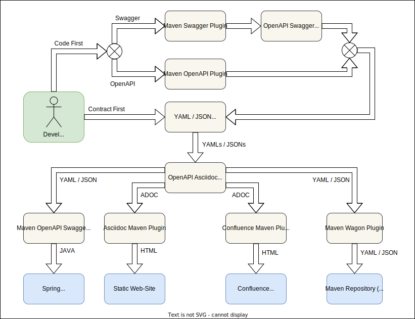

= openapi-asciidoc-maven-plugin
:toc:

== Project Info

[cols="20,80"]
|===

|*Version*
|1.0.3

|*Java*
|OpenJDK 8

|*Maven*
|3.6.3

|===

== Developer Info

[cols="20,80"]
|===

|*Name*
|Denis Volnenko

|*E-mail*
|denis@volnenko.ru

|===

== Context View

== Examples

[cols="20,80"]
|===

|task-manager-openapi-asciidoc
|https://github.com/denis-volnenko/openapi-asciidoc-maven-plugin/blob/master/example/task-manager-openapi-asciidoc/src/main/asciidoc/openapi.adoc

|pet-store-openapi-asciidoc
|https://github.com/denis-volnenko/openapi-asciidoc-maven-plugin/blob/master/example/pet-store-openapi-asciidoc/src/main/asciidoc/index.adoc

|===

== Plugin configuration

=== Repository config

----
<?xml version="1.0" encoding="UTF-8"?>
<project ...>
    ...
    <repositories>
        <repository>
            <id>maven.volnenko.ru</id>
            <name>maven.volnenko.ru</name>
            <url>https://maven.volnenko.ru/repository</url>
            <releases>
                <enabled>true</enabled>
            </releases>
            <snapshots>
                <enabled>true</enabled>
            </snapshots>
        </repository>
    </repositories>
    ...
    <pluginRepositories>
        <pluginRepository>
            <id>openapi-asciidoc-maven-plugin</id>
            <name>GitHub Packages</name>
            <url>https://maven.pkg.github.com/denis-volnenko/openapi-asciidoc-maven-plugin</url>
        </pluginRepository>
        <pluginRepository>
            <id>maven.volnenko.ru</id>
            <name>maven.volnenko.ru</name>
            <url>https://maven.volnenko.ru/repository</url>
        </pluginRepository>
    </pluginRepositories>
    ...
</project>
----

=== Plugin Configuration

----
<?xml version="1.0" encoding="UTF-8"?>
<project ...>
    ...
    <build>
        <plugins>
            <plugin>
                <groupId>ru.volnenko.maven.plugin</groupId>
                <artifactId>maven-openapi-asciidoc-plugin</artifactId>
                <version>1.0.3</version>
                <configuration>
                    <serviceName>Pet Store</serviceName>
                    <headerFirstEnabled>true</headerFirstEnabled>
                    <headerSecondEnabled>true</headerSecondEnabled>
                    <tableOfContentsEnabled>true</tableOfContentsEnabled>
                    <outputPath>${project.basedir}/example/</outputPath>
                    <outputFile>index.adoc</outputFile>
                    <files>
                        <file>${project.basedir}/example/openapi.yaml</file>
                    </files>
                </configuration>
            </plugin>
        </plugins>
    </build>
    ...
</project>
----

== Development

=== Build maven plugin

----
mvn clean install
----

=== Generate documentation

----
mvn openapi-asciidoc:generate
----
